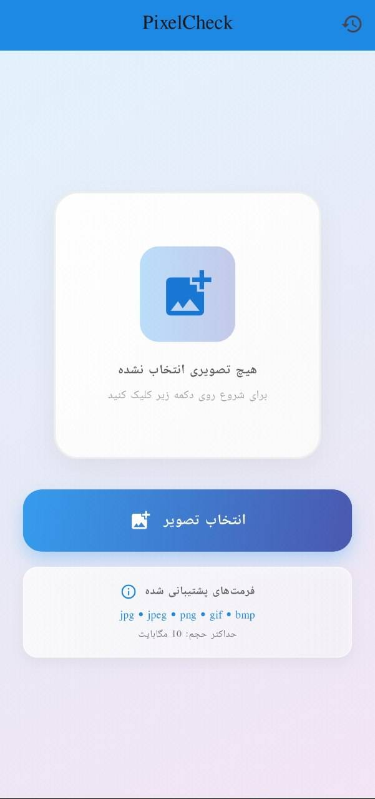
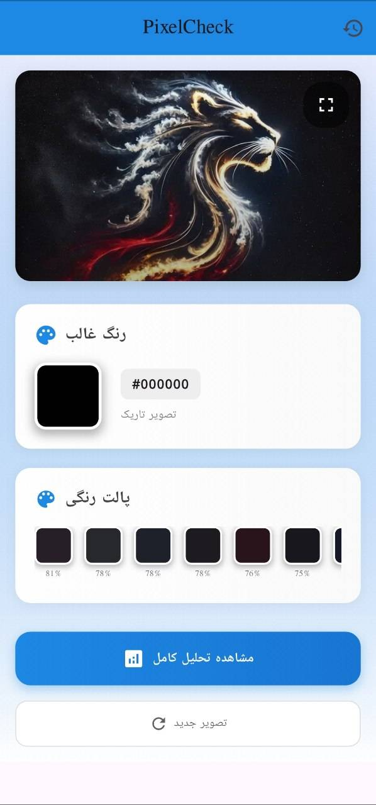
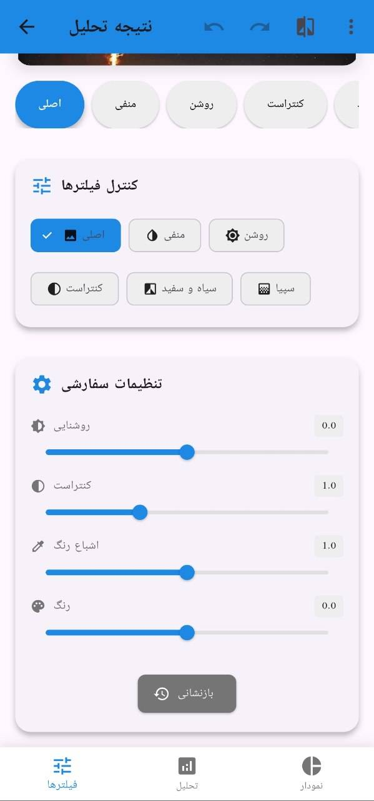
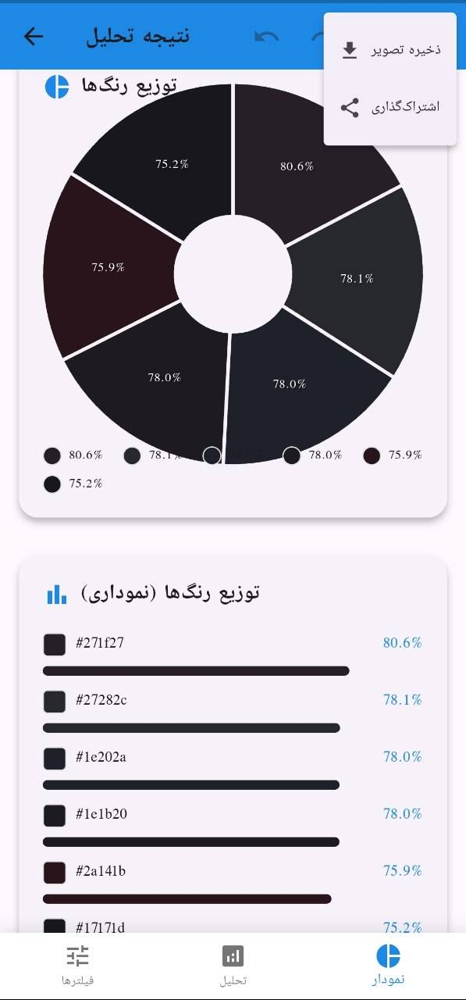

<div align="center">

# 🎨 PixelCheckPro

### *Professional Image Color Analysis Tool*


**🚀 Transform your images into detailed color insights with advanced analysis algorithms**

---

*A powerful and intuitive Flutter application designed for comprehensive image color analysis. Pick images from gallery or camera, analyze color palettes, identify dominant colors, and apply various filters with precision.*

[📱 **Get Started**](#-getting-started) • [🎯 **Features**](#-features) • [🛠️ **Tech Stack**](#️-tech-stack) • [🤝 **Contribute**](#-contributing)

</div>

---

## ✨ **Revolutionary Features**

<div align="center">

</div>

<table>
<tr>
<td width="50%">

### 📸 **Image Picker**
> *Flexible capture & selection system*

🎯 **Gallery & Camera Integration**  
🔍 **Resolution Constraints**  
🖼️ **Multi-Format Support** (JPG, PNG, GIF, BMP)  
⚡ **Instant Preview**

</td>
<td width="50%">

### 🎨 **Color Analysis**
> *Advanced color processing algorithms*

🌈 **Dominant Color Detection**  
🎪 **Palette Generation**  
💡 **Average Brightness Calculation**  
🔬 **Color Distribution Analysis**

</td>
</tr>
<tr>
<td width="50%">

### 🔧 **Image Filtering**
> *Professional editing tools*

🎭 **Filter Collection** (Grayscale, Sepia, Negative)  
🎚️ **Precision Controls** (Brightness, Contrast, Saturation, Hue)  
↔️ **Side-by-Side Comparison**  
🔄 **Real-time Processing**

</td>
<td width="50%">

### 📊 **Analysis Results**
> *Clear data visualization*

📈 **Interactive Pie & Bar Charts**  
🎨 **Color Palette with HEX Codes**  
📤 **Export & Share Functionality**  
📋 **Detailed Percentage Breakdowns**

</td>
</tr>
</table>

### 📈 **Analysis History**
> *Keep track of your color insights*

💾 **Auto-Save Every Analysis** • 🔍 **Search & Browse** • 🗂️ **Organized Management** • 🗑️ **Selective Deletion**

---

## 🖼️ **Visual Showcase**

<div align="center">


| 🏠 **Home Screen** | 🔍 **Analysis Preview** |
|:---:|:---:|
|  |  |

| 🎨 **Image Filtering** | 📊 **Detailed Charts** |
|:---:|:---:|
|  |  |

<div style="background: linear-gradient(45deg, #667eea 0%, #764ba2 50%, #f093fb 100%); padding: 15px; border-radius: 12px; margin: 20px 0; color: white; font-weight: bold; box-shadow: 0 8px 32px rgba(0,0,0,0.1);">
🎯 Experience the future of color analysis in action
</div>

</div>

---

## 🚀 **Getting Started**

<div align="center">


### *Transform your development experience in minutes!*

<div style="background: linear-gradient(135deg, #36BCF7 0%, #667eea 100%); padding: 20px; border-radius: 15px; color: white; margin: 20px 0; box-shadow: 0 10px 40px rgba(54, 188, 247, 0.3);">
💡 <strong>Pro Tip:</strong> Make sure you have Flutter installed for the best experience!
</div>

</div>

### 📋 **Prerequisites**

```bash
✅ Flutter SDK: Installation Guide → https://flutter.dev/docs/get-started/install
✅ Dart SDK: Included with Flutter
✅ IDE: Android Studio or Visual Studio Code with Flutter plugin
```

### ⚡ **Installation**

<table>
<tr>
<td width="50%">

**1️⃣ Clone the Repository**
```bash
git clone https://github.com/your-username/PixelCheckPro.git
```

**2️⃣ Navigate to Project**
```bash
cd PixelCheckPro
```

</td>
<td width="50%">

**3️⃣ Install Dependencies**
```bash
flutter pub get
```

**4️⃣ Run the App**
```bash
flutter run
```

</td>
</tr>
</table>

<div align="center">

🎉 **You're ready to start analyzing colors!**

</div>

---

## 🛠️ **Tech Stack**

<div align="center">


### *Engineered for maximum performance and scalability*

<div style="background: linear-gradient(45deg, #FF6B9D 0%, #C44569 50%, #F8B500 100%); padding: 18px; border-radius: 12px; color: white; margin: 15px 0; box-shadow: 0 8px 25px rgba(255, 107, 157, 0.3);">
⚡ <strong>Lightning Fast:</strong> Optimized algorithms for real-time processing
</div>

</div>

<table>
<tr>
<td align="center" width="33%">

### 🗃️ **Core Framework**
  
**[Flutter](https://flutter.dev/)**

  
**[Dart](https://dart.dev/)**

</td>
<td align="center" width="33%">

### 📄 **State Management**
  
**`setState`**

### 🖼️ **Image Processing**
  
**[image_picker](https://pub.dev/packages/image_picker)**

  
**[image](https://pub.dev/packages/image)**

</td>
<td width="33%">

### 🎨 **UI & Charts**
  
**[fl_chart](https://pub.dev/packages/fl_chart)**

  
**Flutter Built-in**

### 💾 **Local Storage**
  
**[shared_preferences](https://pub.dev/packages/shared_preferences)**

</td>
</tr>
</table>

---

## 📂 **Project Architecture**

<div align="center">

### *Clean and maintainable code structure*

</div>

```
🗃️ lib/
├── 🧠 core/
│   └── image_utils.dart              # Core image processing logic
├── 🎨 features/
│   ├── home_screen.dart              # Main dashboard
│   ├── result_screen.dart            # Analysis results display
│   ├── history_screen.dart           # History management
│   └── image_picker_widget.dart      # Image selection component
├── 📊 models/
│   └── color_data.dart               # Data structures & models
├── 💾 storage/
│   └── color_history_storage.dart    # Local storage management
└── 🚀 main.dart                      # Application entry point
```

### 🔍 **Component Overview**

<table>
<tr>
<td width="50%">

**🧠 `core/`**  
*Contains image processing and analysis algorithms*

**🎨 `features/`**  
*Main screens with UI and state management*

</td>
<td width="50%">

**📊 `models/`**  
*Data structures like `ColorData` and `ImageAnalysisResult`*

**💾 `storage/`**  
*Local storage of analysis history*

</td>
</tr>
</table>

---

## 🔮 **Future Roadmap**

<div align="center">


### *Next-generation features in development*

<div style="background: linear-gradient(135deg, #9C88FF 0%, #5C6BC0 50%, #42A5F5 100%); padding: 20px; border-radius: 15px; color: white; margin: 20px 0; box-shadow: 0 12px 35px rgba(156, 136, 255, 0.4);">
🚀 <strong>Coming Next:</strong> Revolutionary updates that will change everything!
</div>

</div>

<table>
<tr>
<td width="50%">

### 📱 **Live Camera Analysis**
*Real-time color analysis from camera feed*

### ☁️ **Cloud Backup & Sync**
*Backup analysis history to cloud storage*

</td>
<td width="50%">

### 🎨 **Advanced Color Tools**
*Color harmony suggestions and accessibility checking*

### 💻 **Tablet & Desktop Support**
*Responsive UI for larger screens*

</td>
</tr>
</table>

---

## 🤝 **Contributing**

<div align="center">


### *Be part of something extraordinary!*

<div style="background: linear-gradient(45deg, #4ECDC4 0%, #44A08D 100%); padding: 18px; border-radius: 12px; color: white; margin: 15px 0; box-shadow: 0 8px 30px rgba(78, 205, 196, 0.3);">
💝 <strong>Every contribution makes a difference</strong> - Join our growing family of developers!
</div>

</div>

### 🌟 **How to Contribute**

<table>
<tr>
<td width="50%">

**1️⃣ Fork the Project**

**2️⃣ Create Feature Branch**
```bash
git checkout -b feature/NewFeature
```

**3️⃣ Commit Changes**
```bash
git commit -m 'Add some NewFeature'
```

</td>
<td width="50%">

**4️⃣ Push to Branch**
```bash
git push origin feature/NewFeature
```

**5️⃣ Open Pull Request**

*✨ Please add appropriate labels to your PR*

</td>
</tr>
</table>

---

## 📄 **License**

<div align="center">

**Distributed under the MIT License**  
*See `LICENSE` for more information*

---

### 🌟 **Show Your Support**

**If this project helped you, please consider giving it a ⭐!**

<a href="https://github.com/your-username/PixelCheckPro">
  
</a>

---

## 👨‍💻 **Creator**

<div align="center">

### **Made with ❤️ by [7Na7iD7](https://github.com/7Na7iD7)**

*Passionate about making complex concepts accessible through beautiful design*

### 💫 **Welcome to the Future of Color Analysis**


🎨 *Where Technology Meets Creativity* 🎨

---

<div style="background: linear-gradient(135deg, #667eea 0%, #764ba2 100%); padding: 20px; border-radius: 15px; text-align: center; color: white; margin: 20px 0;">

**✨ Join thousands of creators already using PixelCheckPro ✨**

*Transform your visual workflow today*

</div>

</div>
